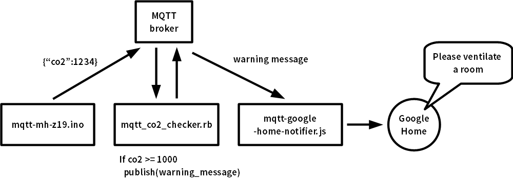

mqtt_co2_checker.rb
====

How to
----

    $ sudo gem install mqtt
    $ git clone https://github.com/yoggy/mqtt_co2_checker.git
    $ cd mqtt_co2_checker
    $ cp config.yaml.sample config.yaml
    $ vi config.yaml
    ※ edit mqtt_host, mqtt_username, mqtt_password, mqtt_subscribe_topic, mqtt_publish_topic...
    $ ./mqtt_co2_checker.rb

    $ crontab -e
    
    0 * * * * /home/pi/work/mqtt_co2_checker/mqtt_co2_checker.rb 2>&1 >/dev/null

Copyright and license
----
Copyright (c) 2018 yoggy

Released under the [MIT license](LICENSE.txt)

